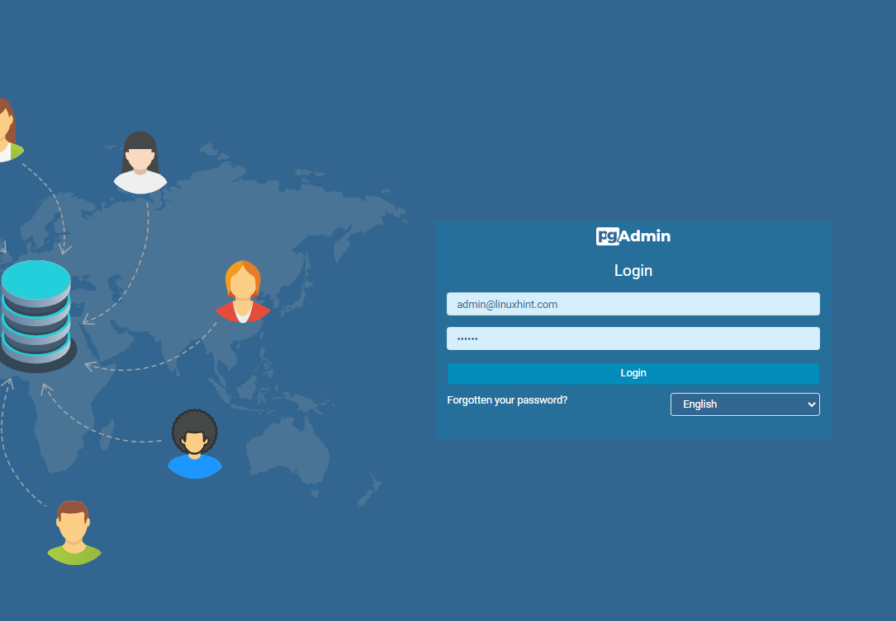
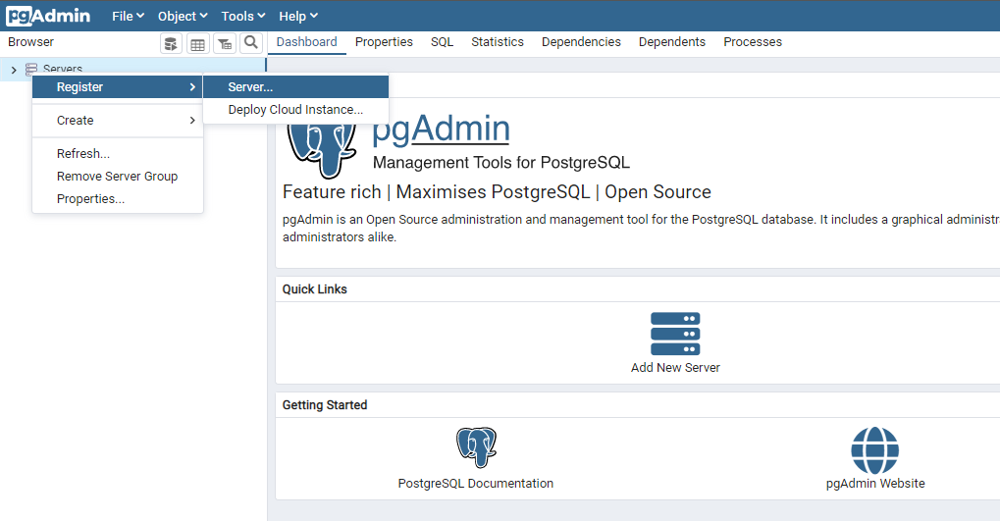
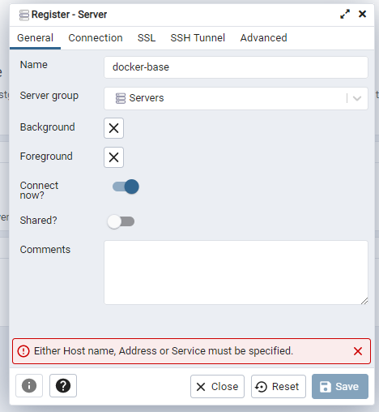
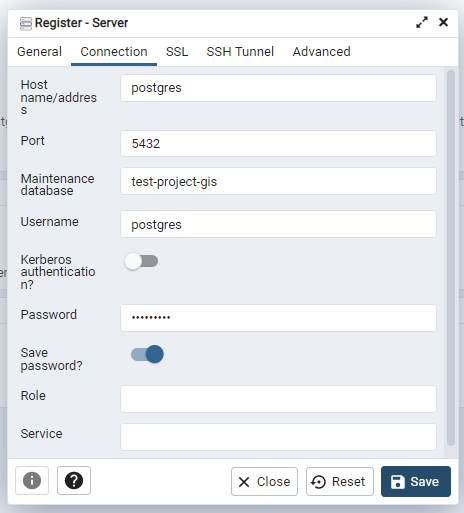
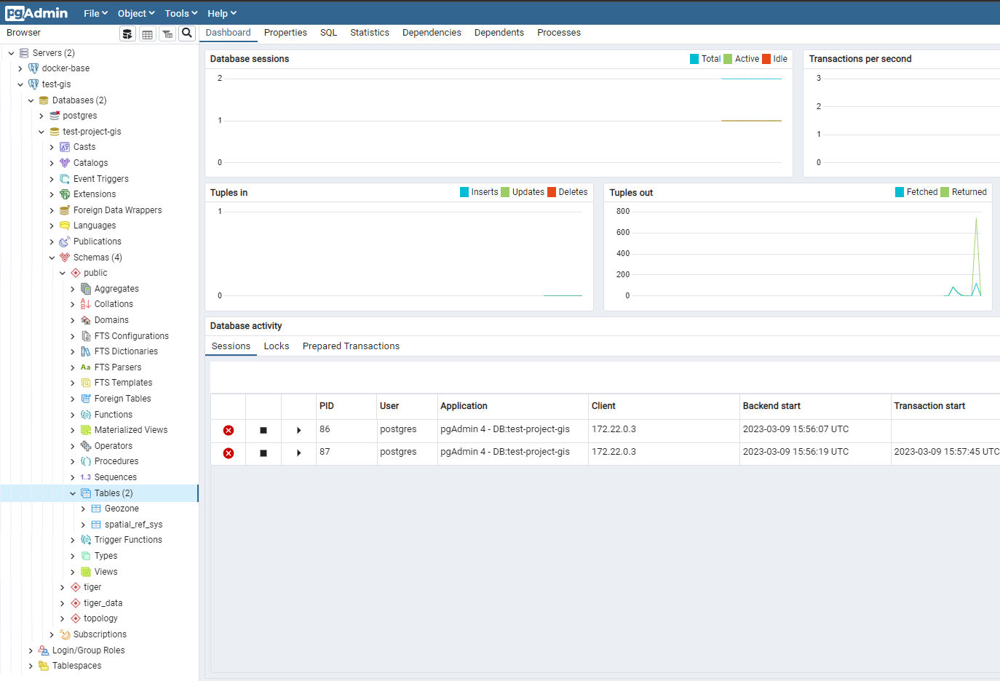

## Установка и запуск внутри докера

---
В папке проекта выполните команду:  
`docker compose  -f "docker-compose.yml" up -d --build postgres pgadmin`  
Подождите пока контейнеры базы поднимутся

---
Как только контейнер запуститься, необходимо перейти в браузере по ссылке `http://localhost:28709/browser/`  

Зайдите в pgAdmin `test_backend`  
Учетные данные:  
* `login` — `admin@linuxhint.com`
* `password` — `secret`

    

---
Далее добавьте сервер базы (подключитесь к базе из pgAdmin)
Нажмите на:  
`Servers -> Register -> Server...`

    

Заполните основную информацию:  
(поле `name` любое на выбор)

    

Заполните информацию подключения:
* `Hostname/address` — `postgres`
* `Port` — `5432`
* `Maintenance database` — `test-project-gis`
* `Password` — `123456789`

    

---

Далее в папке проекта выполните команду:  
`docker compose  -f "docker-compose.yml" up -d --build gis-api`  

Подождите пока контейнер сервера поднимется.

Проверьте таблицу `Geozone` на наличие 
(после запуска сервера она должна автоматически создаться)  
`Databases -> test-project-gis -> Schemas -> public -> Tables`

    

---

Готово!!!
