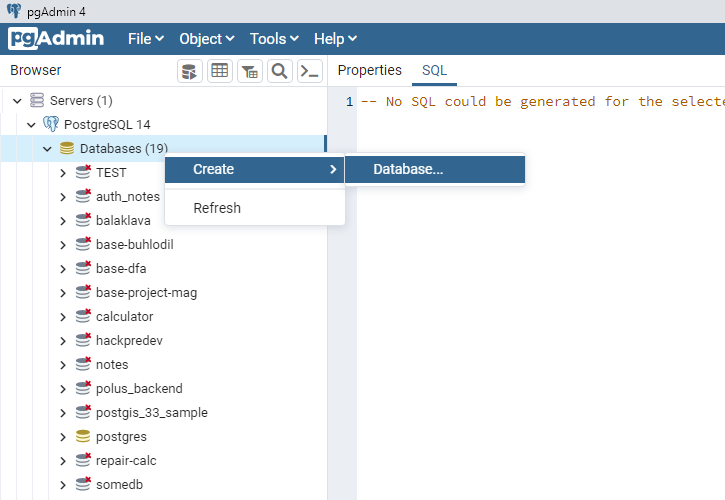
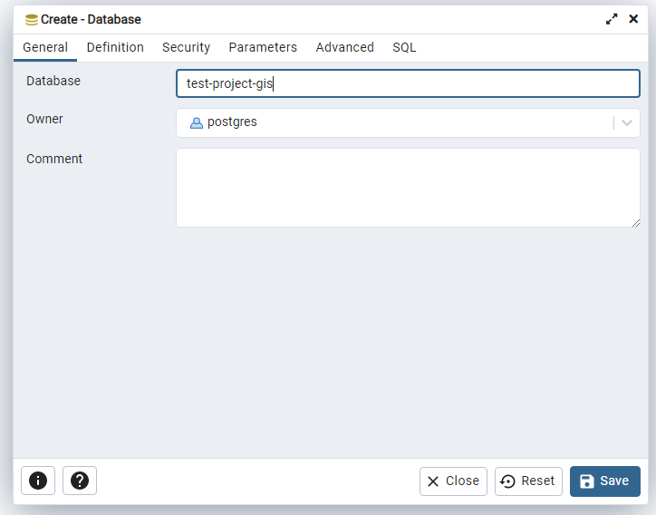
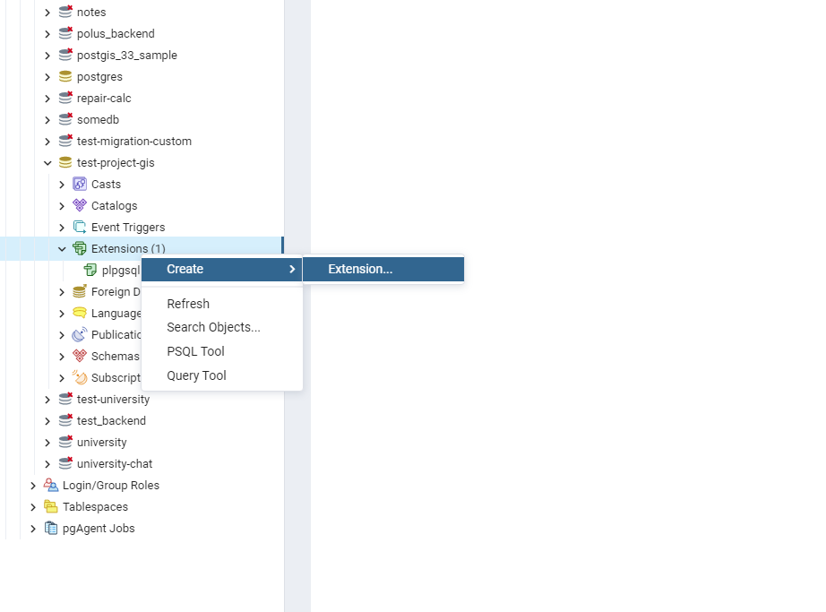
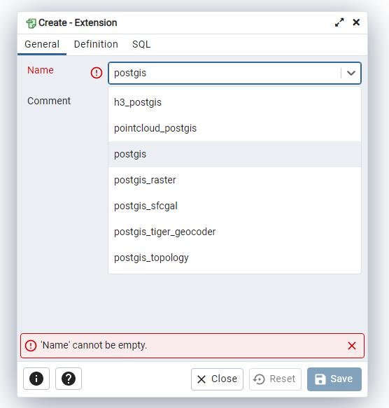

## Установка и запуск без докера

---
Откройте `env` файл в проекте и замените значения следующих полей на свои:

* `POSTGRES_HOST` — `127.0.0.1` или свои значения
* `POSTGRES_PORT` — `5432` или свои значения
* `POSTGRES_USER` — свои значения
* `POSTGRES_PASSWORD` — свои значения

---
Откройте pgAdmin и откройте окно создания базы данных  
`Databases -> Create -> Database...`

    

Назовите базу `test-project-gis`

    

---
Далее зайдите в меню расширений
`Extensions -> Create -> Extension...`

    

Выберите расширение `postgis`
(поле `name` любое на выбор)

    

---

Далее в папке проекта выполните команду:  
`npm run start:dev`  

---

Готово!!!
