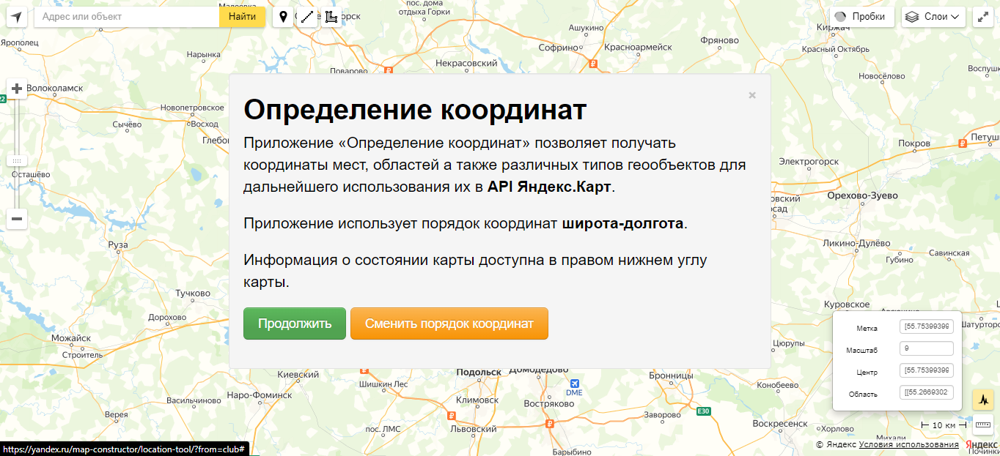
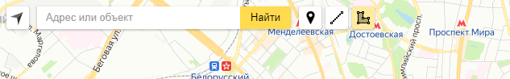
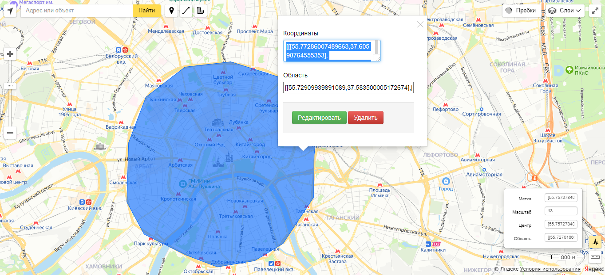
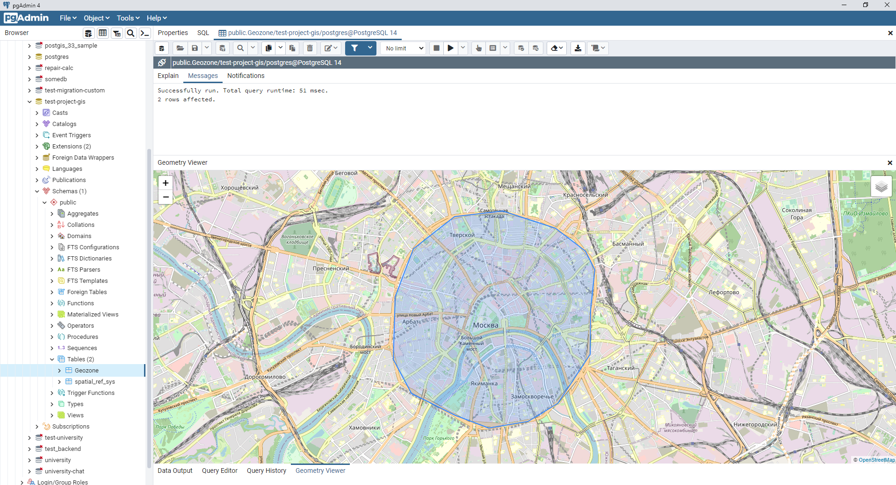

## Установка и запуск без докера

---
Откройте `https://yandex.ru/map-constructor/location-tool/?from=club`  
Нажмите `Продолжить` во всплывшем окне

    

Выберите функцию полигона (выделен желтым цветом)

    

Создайте полигон и скопируйте координаты из поля `Координаты`

    

---

Готово, теперь у вас есть координаты полигона!  
Вот пример того, как выглядят наш полигон в PostGis

    

Координаты полигона приводятся в формату GeoJson (lng,lat), поэтому координаты  полученые другим способом могут приводить немного к другим геолокациям  
(вместо Москвы будет например Иран). Пожалуйста, используйте приведенный выше способ :)

Стоит отметить, что если мы берем координату точки (google maps или yandex maps), то первым значением идет `lng`, вторым значением идет `lat`.